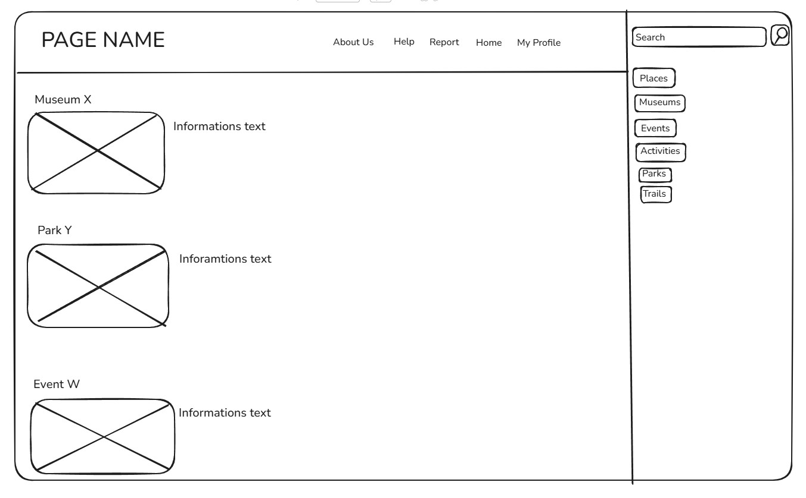
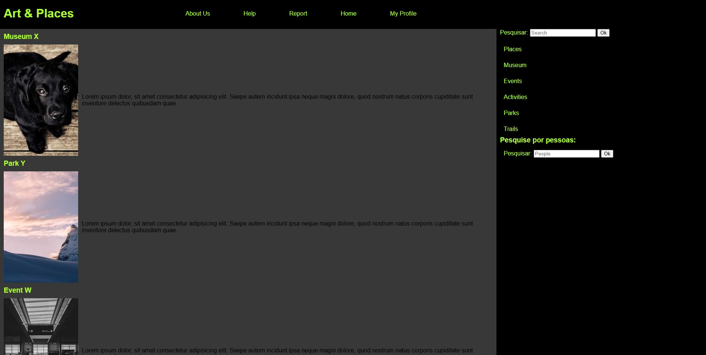

# Trabalho Prático - Semana 04

Dessa vez, vamos escolher uma proposta de projeto para trabalhar.

Nessa atividade, você deverá montar a página inicial do projeto escolhido, a organização do HTML aplicando semântica correta e uso aprimorado do CSS. Leia o enunciado completo no Canvas para mais detalhes.

**IMPORTANTE:** Você deve trabalhar e alterar apenas arquivos dentro da pasta **`public`**. Deixe todos os demais arquivos e pastas desse repositório inalterados. **PRESTE MUITA ATENÇÃO NISSO.**

## Informações Gerais

- Nome:Luis Fernando de Sousa Dias
- Matricula:919214
- Proposta de projeto escolhida:Lugares e Experiências
- Breve descrição sobre seu projeto:Uma aplicacaao na qual as pessoas possam ver sobre os eventos, lugares, parques e atracoes de maneira fácil.

## Print do(s) wireframe(s) criado
> Sugestão, use o Excalidraw para isso. Utilize esse [template básico](https://excalidraw.com/#json=LU-8hwcQEwzk11FwO8Opo,qPU9K6cNUEzlXzwOuKMIlQ) para você começar. 

<<  COLOQUE A IMAGEM AQUI >>

## Print da home-page criada

<<  COLOQUE A IMAGEM AQUI >>

